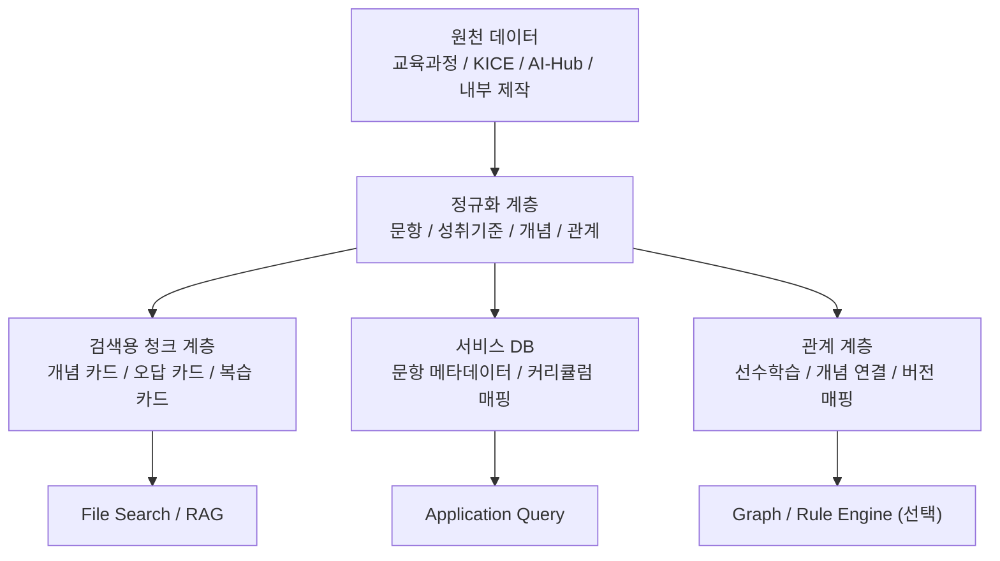
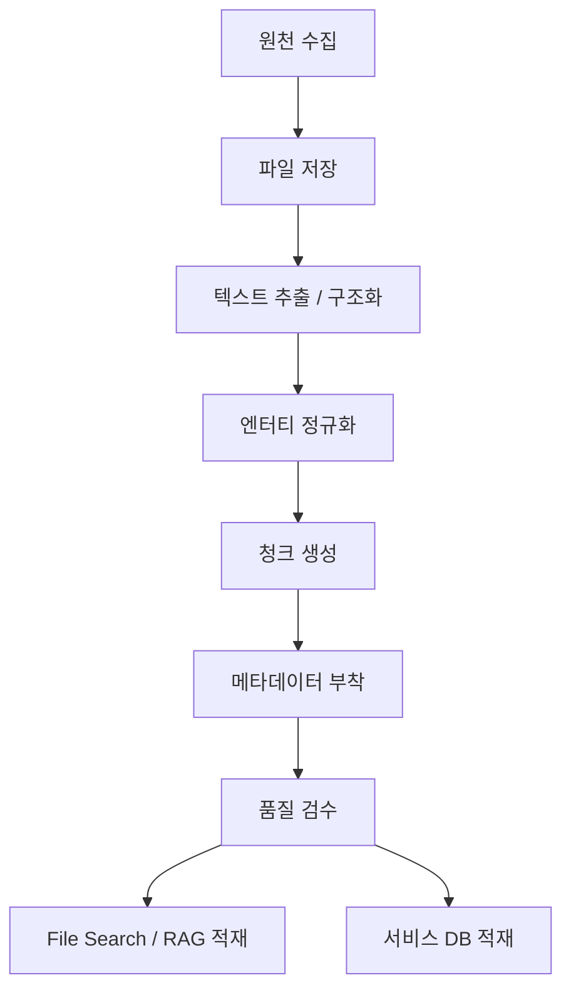

# 내부 지식 구축 명세서

작성일: 2026-04-04  
버전: 0.1  
상태: Draft

## 1. 문서 목적

이 문서는 중고등학생 대상 수학문제 해설 서비스에서 사용할 `내부 지식베이스`를 어떻게 구축할지 정의한다.  
여기서 말하는 내부 지식베이스는 단순한 문서 저장소가 아니라, 아래 목적을 위해 구조화된 검색·보강용 지식 계층이다.

- 문제 풀이 후 개념 설명을 보강한다.
- 교육과정과 성취기준을 연결한다.
- 자주 하는 실수와 오답 포인트를 제시한다.
- 복습 주제와 선수학습 경로를 추천한다.
- 풀이·해설 에이전트와 검증 에이전트가 공통 근거를 참조하게 한다.

이 문서는 특히 다음 질문에 답한다.

- 무엇을 수집해야 하는가
- 어떤 단위로 쪼개서 저장해야 하는가
- 어떤 메타데이터를 붙여야 하는가
- 무엇을 File Search/RAG에 넣어야 하는가
- 무엇은 검색 대상이 아니라 별도 DB나 규칙으로 관리해야 하는가

---

## 2. 핵심 원칙

### 2.1 내부 지식은 문제 정답을 대신 풀어주는 용도가 아니다

내부 지식베이스의 역할은 다음과 같다.

- 풀이 후 개념 설명 보강
- 성취기준 매핑
- 복습 추천
- 오답 포인트 제안

반대로 아래는 내부 지식에 맡기지 않는다.

- 유사문항 검색만으로 정답 추정
- 검색 결과를 그대로 정답처럼 사용
- 증명이 필요한 문제를 과거 해설 문장으로 대체

### 2.2 내부 지식은 `원천 데이터`, `정규화 데이터`, `검색용 청크`를 분리해야 한다

같은 내용을 세 층으로 분리해 관리해야 한다.

- 원천 데이터
  - PDF
  - 이미지
  - 공식 문서 원문
- 정규화 데이터
  - 문항
  - 성취기준
  - 개념
  - 과목
  - 단원
  - 관계 정보
- 검색용 청크
  - 개념 카드
  - 성취기준 카드
  - 오답 카드
  - 복습 카드
  - 풀이 전략 카드

### 2.3 검색 품질은 데이터 양보다 정규화와 메타데이터가 더 중요하다

PDF를 많이 모으는 것만으로는 검색 품질이 올라가지 않는다.  
내부 지식 구축에서 가장 중요한 것은 다음 네 가지다.

- 청크 타입 정의
- 메타데이터 일관성
- 교육과정 버전 구분
- 검수 규칙

---

## 3. 내부 지식의 역할 범위

내부 지식은 아래 에이전트 단계에서 사용된다.

### 3.1 풀이·해설 에이전트

- 핵심 개념 설명
- 자주 하는 실수
- 학생용 설명 톤 보강
- 복습 주제 제안
- 교육과정 후보 생성

### 3.2 전문가 검증 에이전트

- 교육과정 연결 검토
- 개념 태그의 과도성 점검
- 오답 포인트의 적절성 검토
- 설명 근거 검토

### 3.3 워크플로 컨트롤러

- 어떤 검색 타입을 호출할지 결정
- 검색 실패 시 fallback 처리

---

## 4. 지식 계층 구조

권장 지식 계층은 아래와 같다.



### 4.1 계층별 역할

| 계층 | 역할 | 예시 |
| --- | --- | --- |
| 원천 데이터 | 근거 문서 보관 | 교육과정 PDF, KICE 문제지 |
| 정규화 데이터 | 엔터티와 속성 정리 | 성취기준, 개념, 단원 |
| 검색용 청크 | 검색 최적화 | 개념 카드, 복습 카드 |
| 서비스 DB | 빠른 조회 | 문항 메타데이터, curriculum_version |
| 관계 계층 | 선수학습/버전 연결 | 개념 그래프, 2015↔2022 매핑 |

---

## 5. 우선 구축 대상

### 5.1 1차 필수 지식

- 2015 개정 수학과 교육과정
- 2022 개정 수학과 교육과정
- 성취기준
- 중학교/고등학교 단원 체계
- 핵심 개념 카드
- KICE 수능/모평 문항 메타데이터
- 오답 포인트 카드
- 복습 추천 카드

### 5.2 2차 권장 지식

- 대표 풀이 전략 카드
- 난이도 태그
- 유형 태그
- 학생 눈높이별 설명 카드
- 서술형 답안 템플릿

### 5.3 3차 확장 지식

- 선수학습 그래프
- 개념 간 관계 그래프
- 학생별 약점 연결 그래프
- 개인화 복습 경로

---

## 6. 지식 유형 정의

내부 지식은 아래 타입으로 나눠 저장한다.

## 6.1 CurriculumDocument

공식 교육과정 원문 단위다.

- 용도
  - 법적/공식 근거 보관
  - 정규화 파이프라인의 출발점
- 저장 방식
  - 원문 파일
  - 출처 URL
  - 버전 정보

## 6.2 AchievementStandard

성취기준 단위다.

- 용도
  - 교육과정 연결
  - RAG 핵심 검색 단위
- 예시 필드
  - 성취기준 ID
  - 교육과정 버전
  - 학교급
  - 과목
  - 단원
  - 본문

## 6.3 ConceptCard

개념 설명 단위다.

- 용도
  - 풀이 후 개념 설명
  - 학생용 쉬운 설명
- 예시
  - 함수
  - 집합
  - 수열
  - 확률
  - 삼각함수

## 6.4 StrategyCard

문제 풀이 전략 단위다.

- 용도
  - 이런 유형은 어떻게 접근하는지 설명
  - 풀이 방향 후보 제공
- 예시
  - 경우를 나누어 생각하기
  - 치환을 사용하기
  - 그래프로 해석하기
  - 극값 조건을 먼저 세우기

## 6.5 ErrorPatternCard

오답 유형 단위다.

- 용도
  - 자주 하는 실수 설명
  - 검증 에이전트 보강
- 예시
  - 부호 실수
  - 조건 누락
  - 정의역 확인 누락
  - 선택지 대입 미실시

## 6.6 ReviewCard

복습 추천 단위다.

- 용도
  - 현재 문제를 기준으로 복습할 주제 안내
  - 선수 개념 보강

## 6.7 ProblemMeta

문항 자체의 정규화 메타데이터다.

- 용도
  - 문항과 개념, 교육과정 연결
  - 향후 평가셋과 로그 분석

## 6.8 CurriculumMapping

2015 개정과 2022 개정을 연결하는 매핑 정보다.

- 용도
  - 예전 수능 문제를 현재 학생 복습 단원으로 연결

---

## 7. 권장 청크 타입

File Search/RAG에 직접 넣을 청크는 아래 타입을 우선한다.

### 7.1 성취기준 카드

- 가장 중요한 검색 청크
- 짧고 공식적인 설명
- curriculum_version 필수

### 7.2 개념 카드

- 학생용 설명 중심
- 쉬운 정의 + 핵심 포인트 + 연결 개념 포함

### 7.3 오답 카드

- 문제를 틀리는 전형적 이유
- 어떤 조건을 놓치기 쉬운지

### 7.4 복습 카드

- 이 문제 다음에 무엇을 공부하면 좋은지
- 선수학습 또는 연결 단원 안내

### 7.5 풀이 전략 카드

- 특정 유형을 푸는 접근법
- 정답이 아니라 사고 전략 설명

---

## 8. 청킹 원칙

### 8.1 길이 원칙

각 청크는 검색과 인용에 적합한 짧은 단위여야 한다.

- 너무 긴 문서 전체를 한 청크로 넣지 않는다.
- 한 청크는 하나의 핵심 주제를 담는다.
- 하나의 청크는 하나의 사용 목적을 가져야 한다.

### 8.2 의미 원칙

좋은 청크는 질문 하나에 바로 대응할 수 있어야 한다.

예시:

- 집합의 포함 관계란 무엇인가
- 이차함수 최대·최소 문제에서 꼭 확인할 점은 무엇인가
- 경우의 수 문제에서 중복 계산을 피하는 방법은 무엇인가

### 8.3 혼합 금지 원칙

아래를 한 청크에 섞지 않는다.

- 공식 성취기준 + 비공식 교사 메모
- 개념 설명 + 오답 패턴 + 복습 추천
- 2015 개정 + 2022 개정 설명을 구분 없이 혼합

---

## 9. 메타데이터 명세

모든 검색 청크는 아래 메타데이터를 가능한 한 공통으로 가져야 한다.

```json
{
  "id": "string",
  "type": "achievement_standard|concept_card|strategy_card|error_pattern|review_card|problem_meta|curriculum_mapping",
  "curriculum_version": "2009|2015|2022|mixed|unknown",
  "school_level": "middle|high|mixed|unknown",
  "grade_band": "middle1|middle2|middle3|high1|high2|high3|mixed|unknown",
  "subject": "string",
  "unit": "string",
  "subunit": "string",
  "concept_tags": ["string"],
  "difficulty": "low|medium|high|mixed|unknown",
  "source_type": "official|internal|derived",
  "source_name": "string",
  "source_url": "string",
  "language": "ko",
  "verified": true
}
```

### 9.1 메타데이터 필수 항목

- id
- type
- curriculum_version
- school_level
- subject
- source_type
- verified

### 9.2 메타데이터 중요 항목

- unit
- concept_tags
- source_name
- source_url

---

## 10. 권장 데이터 스키마

## 10.1 AchievementStandard 예시

```json
{
  "id": "std_2022_high_commonmath1_set_001",
  "type": "achievement_standard",
  "title": "집합의 포함 관계를 이해한다",
  "text": "집합의 뜻과 표현을 이해하고 포함 관계를 판단할 수 있다.",
  "curriculum_version": "2022",
  "school_level": "high",
  "grade_band": "high1",
  "subject": "공통수학1",
  "unit": "집합과 명제",
  "subunit": "집합의 뜻과 포함 관계",
  "concept_tags": ["집합", "포함관계"],
  "source_type": "official",
  "source_name": "교육과정",
  "source_url": "...",
  "verified": true
}
```

## 10.2 ConceptCard 예시

```json
{
  "id": "concept_high_set_inclusion_001",
  "type": "concept_card",
  "title": "집합의 포함 관계",
  "text": "집합 A의 모든 원소가 집합 B에 들어 있으면 A는 B의 부분집합이다. 문제를 풀 때는 원소 하나하나를 비교하거나 정의를 이용해 포함 여부를 판단한다.",
  "curriculum_version": "2015",
  "school_level": "high",
  "grade_band": "high1",
  "subject": "수학",
  "unit": "집합과 명제",
  "subunit": "집합",
  "concept_tags": ["집합", "부분집합", "포함관계"],
  "difficulty": "low",
  "source_type": "internal",
  "source_name": "internal_curated",
  "source_url": "",
  "verified": true
}
```

## 10.3 ErrorPatternCard 예시

```json
{
  "id": "error_high_function_domain_001",
  "type": "error_pattern",
  "title": "정의역 확인 누락",
  "text": "함수 문제에서 식을 변형한 뒤 정의역 제한을 다시 확인하지 않으면 허용되지 않는 해를 정답으로 고를 수 있다.",
  "curriculum_version": "mixed",
  "school_level": "high",
  "grade_band": "mixed",
  "subject": "수학",
  "unit": "함수",
  "subunit": "",
  "concept_tags": ["함수", "정의역", "허용해"],
  "difficulty": "medium",
  "source_type": "internal",
  "source_name": "internal_curated",
  "source_url": "",
  "verified": true
}
```

---

## 11. 수집 소스 우선순위

### 11.1 A등급 소스

가장 먼저 수집하고 가장 신뢰하는 소스다.

- 교육부 교육과정 고시
- NCIC 성취기준 자료
- KICE 수능/모평 문제 및 정답

### 11.2 B등급 소스

보강용으로 매우 유용하다.

- AI-Hub 수학 관련 데이터
- 공식 보도자료
- 공식 Q&A 자료

### 11.3 C등급 소스

내부 검수 후 제한적으로 사용한다.

- 자체 작성 개념 카드
- 자체 작성 오답 카드
- 자체 작성 복습 추천 카드

### 11.4 D등급 소스

원칙적으로 검색 코퍼스의 핵심 근거로 사용하지 않는다.

- 블로그
- 비공식 카페
- 근거가 불명확한 서술
- 저작권 불명확 자료

---

## 12. 수집 파이프라인

### 12.1 전체 흐름



### 12.2 단계 설명

1. 원천 수집
2. 원문 보관
3. 텍스트 추출
4. 엔터티 정규화
5. 청크 분할
6. 메타데이터 부착
7. 검수
8. 검색 계층 투입

---

## 13. 검수 규칙

### 13.1 공통 검수 규칙

- 교육과정 버전이 비어 있으면 안 된다.
- school_level이 비어 있으면 안 된다.
- type이 불명확하면 안 된다.
- source_type과 source_name이 있어야 한다.
- 내부 파생 문서는 verified 전까지 검색에 넣지 않는다.

### 13.2 내용 검수 규칙

- 한 카드에는 한 개의 핵심 메시지만 넣는다.
- 과도하게 장황한 설명은 줄인다.
- 학생용 설명과 공식 문구를 구분한다.
- 2015와 2022를 혼합 설명할 경우 명시적으로 표시한다.

### 13.3 금지 규칙

- 정답 유출형 해설 카드 양산
- 특정 기출 문항의 원문 재배포형 저장
- 출처가 불명확한 개념 설명 적재
- 검수되지 않은 AI 생성 문서 적재

---

## 14. 내부 지식과 외부 웹 검색의 역할 분리

### 14.1 내부 지식이 맡아야 하는 것

- 교육과정
- 성취기준
- 개념 설명
- 오답 포인트
- 복습 추천
- 버전 매핑

### 14.2 외부 웹 검색이 맡아야 하는 것

- 최신 일정
- 최신 공지
- 최신 제도 변경
- 최신 정오표

### 14.3 원칙

서비스의 핵심 교육 지식은 웹 검색이 아니라 내부 지식베이스를 기준으로 해야 한다.

---

## 15. 폴더 및 파일 구조 권장안

```text
knowledge/
  raw/
    curriculum/
    kice/
    aihub/
  normalized/
    achievement_standards/
    concepts/
    strategies/
    errors/
    reviews/
    problem_meta/
    mappings/
  chunks/
    file_search/
  qa/
    validation_reports/
  manifests/
    source_registry.json
```

### 15.1 파일 네이밍 규칙

- `std_2022_high_commonmath1_set_001.json`
- `concept_2015_high_function_domain_001.json`
- `error_mixed_high_sign_mistake_001.json`
- `review_2022_middle_geometry_001.json`

---

## 16. 초기 시드 데이터셋 제안

### 16.1 1차 시드

- 2015 개정 고등 수학 성취기준
- 2022 개정 중등·고등 수학 성취기준
- 공통 개념 카드 200~500개
- 공통 오답 카드 100~200개
- 복습 카드 100개 이상

### 16.2 2차 시드

- KICE 수능/모평 대표 문항 메타데이터
- 유형별 전략 카드
- 대표 실수 사례

### 16.3 3차 시드

- 선수학습 관계
- 2015↔2022 과목/단원 매핑

---

## 17. File Search 투입 전략

### 17.1 우선 투입 문서

- 성취기준 카드
- 개념 카드
- 오답 카드
- 복습 카드

### 17.2 나중 투입 문서

- 전략 카드
- 버전 매핑 설명 카드
- 유형 설명 카드

### 17.3 투입 전 체크리스트

- metadata 완전성
- 중복 카드 제거
- 검수 완료 여부
- 과도한 길이 여부
- 출처 확인 여부

---

## 18. 검색 전략 제안

### 18.1 풀이·해설 에이전트 검색

검색 목적:

- 개념 설명 보강
- 복습 추천
- 성취기준 후보 생성

권장 필터:

- school_level
- curriculum_version
- subject
- concept_tags

### 18.2 검증 에이전트 검색

검색 목적:

- 교육과정 연결 검토
- 개념 태그 과도성 검토

권장 필터:

- type = achievement_standard
- type = concept_card
- source_type = official or verified internal

---

## 19. 품질 측정 지표

### 19.1 데이터 품질

- metadata 누락률
- 중복률
- 검수 완료율
- source 추적 가능률

### 19.2 검색 품질

- top-k 적중률
- 성취기준 매핑 정확도
- 개념 카드 적합도
- 복습 추천 적합도

### 19.3 운영 품질

- 검색 실패율
- 잘못된 교육과정 연결 비율
- outdated 카드 비율

---

## 20. 운영 규칙

### 20.1 업데이트 주기

- 교육과정/공식 문서: 변경 시 수시 반영
- 내부 개념 카드: 주간 또는 배치 검수
- 오답/복습 카드: 모델 로그와 사용자 질문을 보고 점진적 확장

### 20.2 버전 관리

- 모든 내부 카드에는 version 필드를 둘 수 있다.
- 수정 이력은 changelog로 남긴다.
- deprecated 카드는 바로 삭제하지 말고 상태값으로 비활성화한다.

### 20.3 승인 체계

- 공식 자료 기반 파생 카드
- 내부 전문가 검수 카드
- 자동 생성 후 미검수 카드

이 세 상태를 명확히 구분해야 한다.

---

## 21. 바로 실행할 최소 구축안

지금 당장 가장 현실적으로 시작하려면 아래만 먼저 만든다.

1. 2015/2022 성취기준 정리
2. 중고등 핵심 개념 카드
3. 공통 오답 카드
4. 복습 카드
5. curriculum_version 메타데이터 체계
6. File Search 적재 파이프라인

즉, 처음부터 모든 기출 해설을 쌓기보다 `교육과정 + 개념 + 오답 + 복습`부터 안정적으로 만드는 것이 맞다.

---

## 22. 최종 권장안

내부 지식 구축은 다음 순서로 진행한다.

1. 공식 교육과정과 성취기준을 수집한다.
2. 정규화 엔터티를 만든다.
3. 검색용 카드 단위로 청킹한다.
4. 메타데이터를 강하게 붙인다.
5. 검수 후 File Search/RAG에 넣는다.
6. 이후 문제 메타데이터와 관계 그래프를 확장한다.

한 줄로 정리하면 다음과 같다.

`공식 문서 수집 -> 정규화 -> 카드화 -> 메타데이터 부착 -> 검수 -> 검색 적재`

