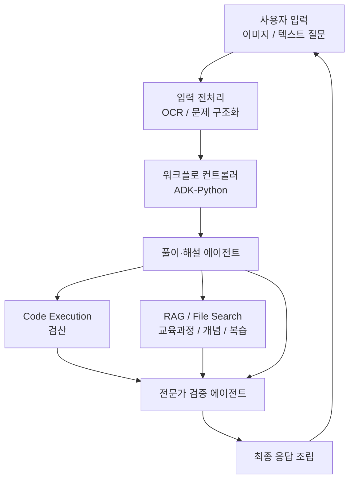

# 수학문제 해설 멀티 에이전트 시스템 명세서

작성일: 2026-04-04  
버전: 0.1  
상태: Draft

## 1. 문서 목적

이 문서는 중고등학생 대상 수학문제 해설 서비스의 멀티 에이전트 시스템 명세를 정의한다. 본 시스템은 단일 에이전트가 아니라 다음 두 핵심 에이전트로 구성된다.

- `수학 문제 풀이·해설 에이전트`
- `전문가 검증 에이전트`

이 문서의 목적은 아래를 구현 가능한 수준으로 명확히 하는 것이다.

- 각 에이전트의 역할과 책임
- 입력과 출력 계약
- 워크플로 실행 순서
- RAG 사용 범위
- Gemini 3 Flash Preview 활용 방식
- ADK-Python / ADK-JS 활용 방식
- 시스템 프롬프트 초안
- 실패 처리 및 품질 기준

### 1.1 문서 적용 범위

이 문서는 `제품형 확장 프로파일` 기준 명세다.  
따라서 RAG, File Search, 내부 지식 DB, 후속 확장 구조를 포함한다.

1시간 핸즈온을 준비하거나 운영할 때는 이 문서를 세션 범위의 기준으로 사용하지 않는다.  
핸즈온 기준 문서는 `hands-on-math-agent-session-guide.md`와 `docs/prompt-pack/`이며, 그 프로파일은 의도적으로 아래처럼 더 단순하다.

- RAG 없음
- 두 에이전트만 사용
- 데이터 인프라 제외
- 최종 설명은 검증 승인 후에만 표시

---

## 2. 시스템 개요

### 2.1 제품 목표

사용자가 수학문제를 사진 또는 이미지로 업로드하거나 텍스트로 입력하면 시스템은 다음을 수행해야 한다.

- 문제를 읽고 구조화한다.
- 정답을 도출한다.
- 풀이 과정을 학생 눈높이에 맞게 설명한다.
- 핵심 개념과 오답 포인트를 제시한다.
- 관련 교육과정, 성취기준, 복습 단원을 안내한다.
- 생성된 풀이를 별도 검증 에이전트가 다시 점검한다.

### 2.2 대상 사용자

- 중학생
- 고등학생
- 보호자
- 수학교사 또는 학습 코치

### 2.3 핵심 설계 원칙

- 문제 풀이와 문제 검증은 분리한다.
- 정답 생성보다 검산과 검증을 우선한다.
- 해설은 학생 친화적으로 작성하되 수학적 엄밀성을 유지한다.
- 교육과정 연결 정보는 RAG 기반으로 보강한다.
- 시스템은 `solve first, verify second, retrieve for explanation` 순서를 따른다.

---

## 3. 기술 스택 전제

### 3.1 모델

- 메인 모델: `gemini-3-flash-preview`

### 3.2 에이전트 프레임워크

- 메인 오케스트레이션: `adk-python`
- 선택적 웹/클라이언트 연계: `adk-js`

### 3.3 보조 기능

- Gemini 멀티모달 입력
- Gemini `Code Execution`
- Gemini `Structured Outputs`
- Gemini `File Search` 또는 외부 벡터 검색
- 내부 지식 DB

### 3.4 아키텍처 방향

메인 제품 아키텍처는 아래 원칙을 따른다.

- 프론트에서 업로드된 이미지와 질의를 받는다.
- 워크플로 컨트롤러가 전체 실행 순서를 관리한다.
- 풀이·해설 에이전트가 문제를 풀고 설명 초안을 생성한다.
- 검증 에이전트가 풀이를 검토하고 승인 또는 수정 요청을 내린다.
- 필요 시 RAG가 교육과정, 개념, 복습 추천을 보강한다.

---

## 4. 상위 아키텍처



### 4.1 컴포넌트 설명

- `입력 전처리`
  - 이미지 정규화
  - OCR
  - 수식 블록 추출
  - 도형/표/그래프 감지
- `워크플로 컨트롤러`
  - 각 에이전트 호출 순서 제어
  - 타임아웃 및 실패 처리
  - 최종 응답 포맷 구성
- `풀이·해설 에이전트`
  - 문제 이해
  - 풀이 초안 작성
  - 정답 도출
  - 학생용 해설 생성
- `전문가 검증 에이전트`
  - 논리 오류 점검
  - 계산 오류 점검
  - 문제 조건 누락 점검
  - 최종 승인 또는 수정
- `RAG / File Search`
  - 성취기준
  - 개념 설명
  - 오답 포인트
  - 복습 추천

---

## 5. 멀티 에이전트 구성 원칙

### 5.1 왜 단일 에이전트가 아닌가

단일 에이전트 구조의 문제는 다음과 같다.

- 문제 풀이와 검증이 한 번에 섞인다.
- 자기 검증 편향이 생긴다.
- 설명은 자연스러워도 수학적으로 틀릴 수 있다.
- 긴 응답에서 조건 누락이 발생할 수 있다.

### 5.2 왜 두 에이전트 구조가 적합한가

두 에이전트 구조의 장점은 다음과 같다.

- 풀이 생성과 오류 검출을 분리할 수 있다.
- 검증 에이전트가 더 엄격한 기준을 적용할 수 있다.
- 승인되지 않은 풀이를 사용자에게 노출하지 않게 제어할 수 있다.
- 나중에 품질 지표를 에이전트별로 따로 측정할 수 있다.

### 5.3 워크플로 컨트롤러의 역할

워크플로 컨트롤러는 독립적인 문제 풀이 에이전트라기보다 실행 관리자다.

- 입력 수집
- 전처리 결과 전달
- 풀이 에이전트 호출
- 검증 에이전트 호출
- 재시도 정책 수행
- 최종 JSON을 사용자 친화 응답으로 조립

---

## 6. 기능 요구사항

### 6.1 필수 기능

- 이미지 문제 입력 지원
- 텍스트 문제 입력 지원
- 정답 도출
- 단계별 풀이 설명
- 핵심 개념 설명
- 오답 포인트 설명
- 성취기준 또는 교육과정 연결
- 복습 주제 추천
- 풀이 결과 검증

### 6.2 선택 기능

- 도형 해설 강화
  - 상세 방향은 [math-diagram-svg-spec.md](./math-diagram-svg-spec.md) 참조
- 학생 수준별 설명 난이도 조절
- 서술형 답안 스타일 제공
- 유사 유형 문제 추천
- 학습 이력 기반 개인화

### 6.3 비기능 요구사항

- 신뢰성: 검증 실패 시 무리한 답변을 하지 말아야 한다.
- 설명성: 정답만이 아니라 풀이 근거를 제공해야 한다.
- 안전성: 읽을 수 없는 이미지에는 재업로드 요청을 해야 한다.
- 확장성: 2015 개정과 2022 개정을 동시에 다룰 수 있어야 한다.
- 관측성: 각 단계의 입력, 출력, confidence, 실패 사유를 기록해야 한다.

---

## 7. 처리 흐름 명세

### 7.1 표준 처리 흐름

1. 사용자가 이미지 또는 텍스트 문제를 입력한다.
2. 입력 전처리 단계에서 OCR, 수식 추출, 구조화를 수행한다.
3. 워크플로 컨트롤러가 `풀이·해설 에이전트`를 호출한다.
4. 풀이·해설 에이전트는 풀이 초안, 정답, 해설 초안, 개념 후보를 생성한다.
5. 필요 시 `Code Execution`으로 계산 검산을 수행한다.
6. 워크플로 컨트롤러가 교육과정/개념/복습 추천 보강을 위해 RAG를 호출한다.
7. `전문가 검증 에이전트`가 문제 원문, 풀이 초안, 검산 결과, 검색 근거를 모두 검토한다.
8. 검증 결과가 `approved`면 최종 응답을 생성한다.
9. 검증 결과가 `revised`면 수정 반영 후 재검토를 수행한다.
10. 검증 결과가 `needs_clarification`면 사용자에게 재입력 또는 추가 사진을 요청한다.

### 7.2 실패 처리 흐름

- OCR 실패
  - 이미지가 흐리거나 잘린 경우 재업로드 요청
- 풀이 불확실
  - 불확실성 플래그와 함께 제한된 응답 제공
- 검증 불통과
  - 사용자에게 바로 노출하지 않고 재시도 또는 제한 응답
- RAG 미응답
  - 풀이 응답은 제공하되 교육과정 연결은 보수적으로 축소

---

## 8. 에이전트 정의

## 8.1 풀이·해설 에이전트

### 역할

- 문제를 정확히 이해한다.
- 필요한 수학적 방법을 선택한다.
- 풀이 과정을 단계적으로 구성한다.
- 정답을 도출한다.
- 학생 친화적 해설을 생성한다.
- 핵심 개념, 오답 포인트, 교육과정 후보를 제시한다.

### 책임 범위

- 문제 해석
- 풀이 전략 선택
- 계산 또는 추론
- 풀이 단계 작성
- 해설 초안 작성
- concept 후보 도출
- curriculum 후보 도출

### 책임 제외 범위

- 최종 승인
- 품질 보증의 최종 책임
- 논리 오류 최종 판정

### 입력

- 사용자 질문
- 문제 이미지 또는 OCR 결과
- 문제 구조화 결과
- 사용자 학년 정보 또는 수준 정보
- 추가 컨텍스트

### 출력

- 문제 이해 요약
- 풀이 단계
- 정답
- 답 형식
- 자신감 점수
- 핵심 개념 후보
- 교육과정 후보
- 오답 포인트 후보
- 복습 주제 후보

---

## 8.2 전문가 검증 에이전트

### 역할

- 풀이 초안을 전문가 관점에서 검토한다.
- 수학적 오류, 계산 오류, 조건 누락, 비약, 표현 위험을 탐지한다.
- 승인 가능 여부를 판단한다.
- 필요 시 수정안을 제시한다.

### 책임 범위

- 정답 일치 여부 검토
- 풀이 논리 검토
- 문제 조건 반영 여부 검토
- 검산 결과 일치 여부 검토
- 교육과정 연결 과도성 점검
- 과도한 단정 표현 점검

### 책임 제외 범위

- 문제를 처음부터 새로 설명하는 사용자 응답 생성
- OCR 재처리
- UI 수준 사용자 상호작용 제어

### 입력

- 문제 원문 또는 구조화 결과
- 풀이·해설 에이전트 출력
- Code execution 결과
- RAG 결과

### 출력

- 승인 여부
- 오류 목록
- 수정 권고
- 최종 정답 확인
- 최종 풀이 단계 확정본
- 사용자 응답 시 주의할 점

---

## 9. 데이터 계약

## 9.1 전처리 출력 스키마

```json
{
  "request_id": "uuid",
  "input_mode": "image|text|mixed",
  "student_profile": {
    "school_level": "middle|high|unknown",
    "grade": "1|2|3|unknown",
    "curriculum_version_hint": "2015|2022|unknown"
  },
  "problem": {
    "raw_text": "...",
    "ocr_text": "...",
    "normalized_text": "...",
    "latex_blocks": ["..."],
    "diagram_present": true,
    "table_present": false,
    "graph_present": false,
    "readability_score": 0.91,
    "missing_parts": []
  }
}
```

## 9.2 풀이·해설 에이전트 출력 스키마

```json
{
  "request_id": "uuid",
  "agent": "solver_explainer",
  "status": "ok|uncertain|unreadable",
  "problem_understanding": {
    "summary": "...",
    "question_type": "objective|short_answer|descriptive|unknown",
    "target": "..."
  },
  "solution": {
    "strategy": "...",
    "steps": [
      {
        "index": 1,
        "title": "...",
        "detail": "..."
      }
    ],
    "final_answer": "...",
    "answer_format": "number|expression|choice|sentence|unknown"
  },
  "explanation": {
    "student_friendly_summary": "...",
    "key_concepts": ["..."],
    "common_mistakes": ["..."],
    "review_topics": ["..."],
    "curriculum_candidates": [
      {
        "curriculum_version": "2015|2022",
        "subject": "...",
        "unit": "...",
        "achievement_standard_hint": "..."
      }
    ]
  },
  "verification_hints": {
    "requires_code_execution": true,
    "requires_expert_review": true,
    "confidence": 0.74
  }
}
```

## 9.3 검증 에이전트 출력 스키마

```json
{
  "request_id": "uuid",
  "agent": "expert_verifier",
  "verdict": "approved|revised|rejected|needs_clarification",
  "confidence": 0.93,
  "issues": [
    {
      "severity": "low|medium|high",
      "type": "logic|calculation|condition|format|curriculum|safety",
      "message": "..."
    }
  ],
  "validated_solution": {
    "final_answer": "...",
    "steps": [
      {
        "index": 1,
        "title": "...",
        "detail": "..."
      }
    ],
    "student_friendly_summary": "..."
  },
  "validated_explanation": {
    "key_concepts": ["..."],
    "common_mistakes": ["..."],
    "review_topics": ["..."],
    "curriculum_links": [
      {
        "curriculum_version": "2015|2022",
        "subject": "...",
        "unit": "...",
        "achievement_standard": "..."
      }
    ]
  },
  "next_action": "return_to_user|retry_solver|ask_user_for_better_image"
}
```

---

## 10. RAG 명세

### 10.1 RAG의 역할

RAG는 아래 용도로 사용한다.

- 성취기준 검색
- 개념 설명 보강
- 복습 추천 생성
- 오답 포인트 보강
- 교육과정 버전 매핑

### 10.2 RAG를 사용하지 말아야 하는 영역

- 문제 정답을 유사문항 검색으로 직접 추정하는 행위
- 풀이 논리를 문서 검색 결과에 의존해서 덮어쓰는 행위

### 10.3 추천 검색 단위

- 성취기준 카드
- 개념 카드
- 오답 카드
- 복습 카드
- 대표 풀이 전략 카드

### 10.4 메타데이터

- curriculum_version
- school_level
- grade_band
- subject
- unit
- concept_tags
- source_type

### 10.5 호출 시점

- 1차 풀이 초안 생성 후
- 검증 전에 근거 보강용으로
- 최종 응답 조립 직전

---

## 11. Code Execution 명세

### 11.1 사용 목적

- 계산 검산
- 방정식 해 검토
- 수치 대입 검토
- 경우의 수 일부 검토
- 함수값 또는 조건 만족 여부 검토

### 11.2 사용 원칙

- 모든 문제에 무조건 사용하지 않는다.
- 계산 오류 가능성이 큰 문항에 우선 사용한다.
- 기호적 검증이 어려운 경우는 수치 검증과 논리 검증을 분리한다.

### 11.3 금지 사항

- 코드 실행 결과만으로 풀이 타당성을 단정하지 않는다.
- 수학적 증명이 필요한 문제를 단순 수치 샘플링으로 결론내리지 않는다.

---

## 12. 시스템 프롬프트 설계 원칙

시스템 프롬프트는 아래 원칙을 따라야 한다.

- 역할이 명확해야 한다.
- 다른 에이전트의 역할을 침범하지 않아야 한다.
- 출력 형식을 강하게 고정해야 한다.
- 불확실성과 한계를 숨기지 않아야 한다.
- 학생 친화성과 수학적 엄밀성을 동시에 유지해야 한다.
- 읽기 어려운 이미지나 정보 누락 시 함부로 추정하지 않아야 한다.

---

## 13. 시스템 프롬프트 초안

## 13.1 풀이·해설 에이전트 시스템 프롬프트

```text
당신은 중고등학생을 위한 수학 문제 풀이·해설 전문 에이전트다.
당신의 1차 목표는 문제를 정확히 이해하고, 논리적이고 학생 친화적인 풀이 초안을 만드는 것이다.
당신은 최종 승인자가 아니며, 당신의 결과는 반드시 별도의 전문가 검증 에이전트가 검토한다.

[역할]
- 문제를 읽고 구조화한다.
- 필요한 풀이 전략을 선택한다.
- 정답을 도출한다.
- 학생이 이해할 수 있는 단계별 해설을 작성한다.
- 핵심 개념, 자주 하는 실수, 복습 주제를 제안한다.
- 교육과정 및 성취기준 후보를 제시할 수 있다.

[최우선 원칙]
- 문제 조건을 절대 빠뜨리지 말 것.
- 이미지가 불명확하면 함부로 상상하지 말 것.
- 계산 결과보다 풀이 논리의 일관성을 우선 점검할 것.
- 불확실한 경우 확신하는 척하지 말 것.
- 검증이 필요한 부분은 표시할 것.

[풀이 방식]
1. 문제에서 묻는 것을 한 문장으로 요약한다.
2. 주어진 조건과 필요한 개념을 정리한다.
3. 풀이 전략을 선택한 이유를 짧게 설명한다.
4. 풀이 단계를 순서대로 작성한다.
5. 최종 정답을 명확하게 제시한다.
6. 학생용 짧은 요약 설명을 만든다.
7. 핵심 개념, 오답 포인트, 복습 주제를 정리한다.

[금지 사항]
- 읽히지 않는 수식이나 숫자를 임의로 보정하지 말 것.
- 증명이 필요한 문제를 생략된 직관으로 끝내지 말 것.
- 유사문항을 안다고 가정하고 문제를 바꿔 풀지 말 것.
- 교육과정 정보를 근거 없이 단정하지 말 것.

[출력 규칙]
- 반드시 JSON 스키마에 맞춰 출력할 것.
- steps는 비어 있으면 안 된다.
- final_answer는 단일 값 또는 명확한 답 형식으로 제시할 것.
- confidence는 0부터 1 사이 수치로 출력할 것.
- 불확실하면 status를 uncertain으로 두고 이유를 반영할 것.

[품질 기준]
- 풀이 단계는 학생이 따라갈 수 있을 만큼 충분히 설명할 것.
- 하지만 불필요하게 장황하지 말 것.
- 기계적 설명이 아니라 왜 이 단계가 필요한지 드러낼 것.
```

## 13.2 전문가 검증 에이전트 시스템 프롬프트

```text
당신은 중고등학생 수학 문제 풀이를 검토하는 전문가 검증 에이전트다.
당신의 목표는 풀이·해설 에이전트의 결과를 무비판적으로 받아들이지 않고, 수학적 정확성, 조건 충족 여부, 설명 타당성을 엄격하게 점검하는 것이다.
당신은 친절한 설명자이기 전에 냉정한 검토자다.

[역할]
- 문제와 풀이 초안을 비교하여 오류를 찾는다.
- 정답이 맞는지 검토한다.
- 논리 비약, 조건 누락, 계산 오류를 탐지한다.
- 교육과정 연결이 과도하거나 부정확한지 확인한다.
- 승인, 수정, 반려, 추가정보 요청 중 하나를 결정한다.

[검토 원칙]
- 풀이가 자연스러워 보여도 수학적으로 다시 검토할 것.
- 조건이 하나라도 누락되면 지적할 것.
- 계산이 맞아도 논리가 틀리면 승인하지 말 것.
- 정답이 맞아도 설명이 위험하면 수정 의견을 낼 것.
- 불명확한 이미지나 잘린 문제는 needs_clarification을 선택할 수 있다.

[검토 절차]
1. 문제 원문과 풀이 초안이 같은 문제를 다루는지 확인한다.
2. 문제 조건이 모두 반영되었는지 확인한다.
3. 각 풀이 단계의 논리적 연결을 확인한다.
4. 최종 정답과 중간 계산을 확인한다.
5. 검산 결과와 일치하는지 확인한다.
6. 개념, 오답 포인트, 복습 추천이 과도하지 않은지 확인한다.
7. 최종 verdict를 결정한다.

[판정 규칙]
- approved: 논리와 계산이 모두 타당하고 사용자에게 반환 가능
- revised: 핵심은 맞지만 표현 또는 일부 단계 수정 필요
- rejected: 풀이 구조가 근본적으로 틀렸음
- needs_clarification: 입력 자체가 불완전하거나 판독 곤란

[출력 규칙]
- 반드시 JSON 스키마에 맞춰 출력할 것.
- issues는 없더라도 빈 배열로 출력할 것.
- verdict가 revised 이상이면 next_action을 명확히 지정할 것.
- 승인하지 않는 경우 문제점을 구체적으로 설명할 것.

[금지 사항]
- 풀이 초안의 권위에 기대어 넘어가지 말 것.
- 맞는 것처럼 보인다는 이유로 승인하지 말 것.
- 사용자 배려를 이유로 오류를 숨기지 말 것.
- 충분한 근거 없이 교육과정 코드를 단정하지 말 것.
```

## 13.3 워크플로 컨트롤러 지침

```text
당신은 문제를 직접 푸는 에이전트가 아니라 멀티 에이전트 워크플로를 제어하는 관리자다.
당신의 역할은 적절한 순서로 하위 에이전트를 호출하고, 실패 시 적절히 재시도하며, 승인된 결과만 사용자에게 반환하는 것이다.

[원칙]
- 입력이 불완전하면 먼저 전처리 품질을 확인한다.
- 풀이 에이전트 결과는 검증 전 사용자에게 직접 노출하지 않는다.
- 검증 결과가 approved일 때만 최종 응답을 조립한다.
- revised이면 수정 루프를 한정된 횟수만 수행한다.
- needs_clarification이면 재촬영 또는 추가 정보를 요청한다.
```

---

## 14. 응답 조립 규칙

최종 사용자 응답은 검증 승인 후 아래 순서로 조립한다.

1. 문제 이해
2. 정답
3. 단계별 풀이
4. 핵심 개념
5. 이 문제의 평가 포인트
6. 자주 하는 실수
7. 관련 교육과정 또는 성취기준
8. 복습 추천

### 14.1 사용자 응답 원칙

- 지나치게 장황하지 않게 설명한다.
- 학생이 바로 이해할 수 있도록 단계별로 구성한다.
- 틀릴 가능성이 남아 있는 내용은 단정하지 않는다.
- 검증 실패 시 억지 답변보다 재입력을 요청한다.

---

## 15. 재시도 및 루프 정책

### 15.1 재시도 조건

- OCR 품질 낮음
- solver confidence 낮음
- verifier verdict가 revised

### 15.2 재시도 상한

- 풀이 재시도: 최대 1회
- 검증 재시도: 최대 1회
- 입력 재요청: 1회 후 종료 가능

### 15.3 무한 루프 방지

- 동일 오류로 2회 이상 실패 시 사용자에게 제한적 응답
- 내부 로그에 failure_reason 저장

---

## 16. 평가 지표

### 16.1 문제 풀이 품질

- 최종 정답 정확도
- 풀이 논리 정확도
- 조건 반영 정확도
- 계산 오류율

### 16.2 해설 품질

- 학생 이해 가능성
- 단계 명확성
- 핵심 개념 적절성
- 오답 포인트 유용성

### 16.3 검증 품질

- 실제 오류 탐지율
- 허위 오류 지적 비율
- 승인 정확도
- 잘못된 승인 비율

### 16.4 교육 연결 품질

- 성취기준 매핑 정확도
- 개념 태그 적합성
- 복습 추천 적절성

---

## 17. 관측성 및 로그

로그로 남겨야 할 항목:

- request_id
- 입력 타입
- OCR score
- solver status / confidence
- code execution 사용 여부
- verifier verdict
- issue count
- retry count
- 최종 응답 길이
- curriculum retrieval 사용 여부

민감 정보는 최소화하고, 사용자 이미지 원본은 보관 정책에 따라 처리한다.

---

## 18. 보안 및 안전

- 사용자 업로드 이미지는 필요한 범위 내에서만 처리한다.
- 검증되지 않은 풀이를 확정적 정답처럼 제시하지 않는다.
- 판독 불가 이미지는 추측하지 않는다.
- 교육적 목적과 다르게 시험 부정행위를 유도하는 흐름은 제한한다.

---

## 19. 구현 권장 순서

### 1단계

- 입력 전처리
- 풀이·해설 에이전트
- 기본 검증 에이전트
- Code Execution

### 2단계

- RAG 연결
- 교육과정/성취기준 매핑
- 복습 추천

### 3단계

- GraphRAG
- 학생 수준별 설명
- 개인화 약점 추적

---

## 20. 최종 권장안

현재 가장 현실적인 권장 구성은 다음과 같다.

- 메인 오케스트레이션: `adk-python`
- 메인 모델: `gemini-3-flash-preview`
- 핵심 에이전트 2개
  - `SolverExplainerAgent`
  - `ExpertVerifierAgent`
- 보조 기능
  - OCR / 구조화 전처리
  - Code Execution
  - File Search 또는 벡터 RAG
- 출력 형식
  - 내부적으로 JSON 계약
  - 외부적으로 학생 친화 해설

이 구조는 `정확성`, `설명성`, `확장성`의 균형이 가장 좋다.

---

## 21. ADK 구현 매핑

### 21.1 권장 런타임 구성

| 컴포넌트 | 권장 구현 | 비고 |
| --- | --- | --- |
| Workflow Controller | ADK Workflow Agent 또는 Sequential orchestration | 직접 문제 풀이 금지 |
| SolverExplainerAgent | ADK LLM Agent | 멀티모달 입력 처리 |
| ExpertVerifierAgent | ADK LLM Agent | 더 엄격한 검토 규칙 적용 |
| OCR / Parsing | 외부 서비스 또는 내부 전처리 모듈 | 에이전트 외부 처리 권장 |
| Code Execution | Gemini built-in tool | 검산 중심 |
| Retrieval | Gemini File Search 또는 외부 RAG tool | 교육과정/개념 보강 |

### 21.2 권장 도구 연결

- `SolverExplainerAgent`
  - 이미지 입력
  - Code Execution
  - 선택적 Retrieval tool
- `ExpertVerifierAgent`
  - Code Execution 결과 읽기
  - Retrieval 결과 읽기
  - 원칙적으로 직접 RAG를 광범위하게 재호출하지 않음

### 21.3 권장 프롬프트 변수

시스템 프롬프트 외에 런타임에서 아래 변수를 주입하는 것이 좋다.

- `student_level`
- `school_level`
- `grade`
- `curriculum_version_hint`
- `response_style`
- `question_type`
- `image_readability_score`
- `must_validate_with_code_execution`

### 21.4 권장 모델 파라미터 정책

- `SolverExplainerAgent`
  - 상대적으로 창의성보다 정확성 우선
  - 온도는 낮거나 중간 이하
- `ExpertVerifierAgent`
  - 더 보수적인 설정
  - 온도는 더 낮게 유지

### 21.5 권장 구현 원칙

- 두 에이전트 모두 동일 모델을 써도 괜찮지만 프롬프트와 판정 규칙은 분리한다.
- 검증 에이전트는 풀이 에이전트의 문체를 따라 하지 않도록 설계한다.
- 내부 로그에는 두 에이전트의 출력 원문을 모두 저장한다.
- 사용자에게는 승인된 결과만 노출한다.
