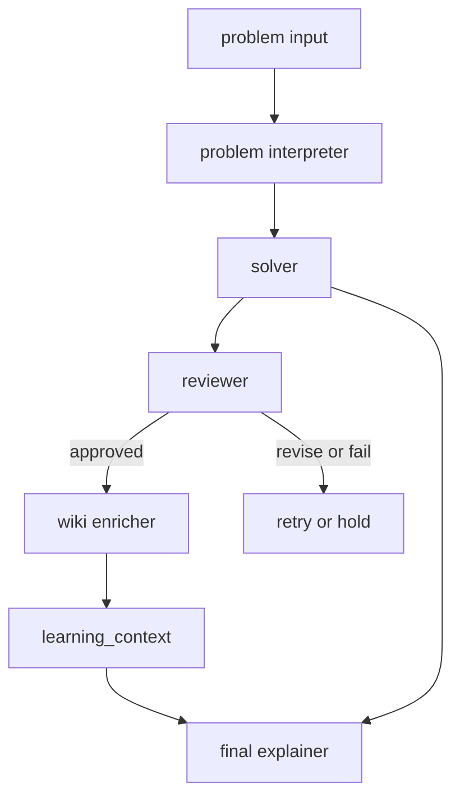

# 02a. Wiki Enricher 확장 프롬프트

## 목적

기본 `Solver/Explainer + Expert Verifier` 구조가 안정적으로 돌아간 뒤, `LLM Wiki`에서 관련 수학 지식을 읽어 `학습 정보`를 보강하는 확장 에이전트를 설계한다.

이 확장 에이전트의 목표는 정답을 대신 맞히는 것이 아니라, 문제 풀이가 승인된 뒤 아래 정보를 더 잘 설명하게 만드는 것이다.

- 이 문제의 난이도
- 포함된 핵심 개념
- 관련 교육과정
- 같이 보면 좋은 연관 학습 주제

## 언제 사용하나

- 기본 two-agent 구조가 먼저 동작할 때
- `ADK`에서 runtime context로 `learning_context`를 주입하고 싶을 때
- 최종 해설에 `학습 정보 카드`를 추가하고 싶을 때

## 1. 역할 정의 프롬프트

```text
We already have two agents:
1. Solver/Explainer
2. Expert Verifier

Now define an optional third agent called Wiki Knowledge Enricher for an ADK-based math explanation system.

This agent should:
- run only after the verifier approves the solution
- read the minimum relevant LLM wiki pages
- build a structured learning_context
- identify:
  - difficulty
  - core concepts
  - related curriculum placement
  - follow-up topics
  - wiki basis pages

For this agent, describe:
- role
- responsibilities
- what it should not do
- input
- output
- where it fits in the orchestration

Important rules:
- do not use wiki content to guess the math answer
- do not run before approval
- if wiki evidence is weak, mark the result as tentative

Write the result in Korean and keep it practical for a workshop.
```

## 2. ADK 오케스트레이션 흐름

기본 흐름은 그대로 두고, `approved` 이후에만 `wiki enricher`를 끼워 넣는다.



`ADK`에서는 보통 아래처럼 나눈다.

- `approved_solution`
  - reviewer가 통과시킨 풀이 결과
- `learning_context`
  - wiki enricher가 만든 학습 메타데이터
- `final_explainer`
  - `approved_solution + learning_context`를 합쳐 최종 사용자 응답 생성

즉, 정답은 solver와 reviewer가 만들고, `교육과정/난이도/개념`은 wiki enricher가 보강한다.

## 3. Wiki Lookup 인터페이스

실제 `ADK` 앱 에이전트에서는 prompt만으로 workspace wiki를 읽는 대신, 로컬 file lookup helper나 tool을 두는 편이 맞다.

핸즈온에서는 아래 수준으로 고정하면 충분하다.

- 입력
  - `problem_text`
  - `concept_candidates`
  - `approved_solution_summary`
  - `target_profile`
- 검색
  - `wiki/index.md` 먼저 조회
  - 관련 wiki page 최소 조회
- 출력
  - `query_keywords`
  - `index_excerpt`
  - `matches`
  - `usage_notes`

starter kit에는 아래 helper 골격이 들어간다.

- Python: `starter-kits/adk-python/shared/wiki_lookup_tool.py`
- Go: `starter-kits/adk-go/shared/wiki_lookup_tool.go`

이 helper의 출력은 최종 답변이 아니라, `Wiki Knowledge Enricher`가 `learning_context`를 만들기 위한 compact evidence seed다.

## 4. 참석자용 프롬프트 지시문

아래 문장은 `wiki enricher` 에이전트 prompt나 orchestrator instruction에 그대로 넣어도 된다.

```text
After the verifier approves the solution, run a wiki enrichment step.

Workflow:
1. Read wiki/index.md first.
2. Find the minimum relevant curriculum, hub, or concept pages.
3. Read only the relevant pages.
4. Build a structured learning_context with:
   - difficulty
   - core concepts
   - related curriculum placement
   - follow-up topics
   - wiki basis pages

Rules:
- Do not use wiki content to guess the math answer.
- Do not run wiki enrichment before verification approval.
- Keep learning_context compact and structured.
- If wiki evidence is weak, mark the mapping as tentative.
```

최종 설명 에이전트에는 아래 규칙을 넣는 편이 좋다.

```text
Use approved_solution for the math explanation.
Use learning_context only for difficulty, concepts, curriculum placement, and follow-up topics.
Do not invent curriculum mappings outside learning_context.
If learning_context is weak, say that the mapping is tentative.
```

## 기대 산출물

- `Wiki Knowledge Enricher` 역할 정의
- `approved -> wiki enrichment -> final explanation` 흐름
- `learning_context`를 만드는 prompt instruction 초안
- wiki lookup helper/tool 인터페이스
